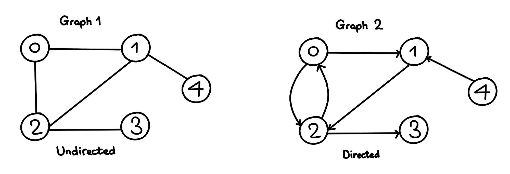
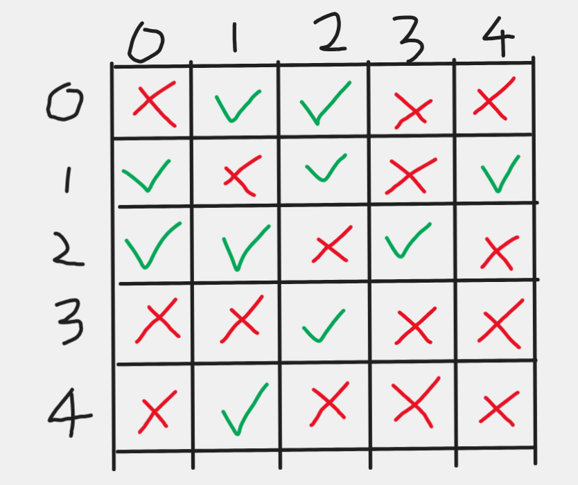

# Graph - Intro
###### Author - Alan Tao

Today we learned briefly about graphs. There are two components of a graph, edge and node. An undirected graph is one with edges that go both ways. A directed graph is a graph that has edges that go in one direction. 



We can also have weights on the edges, which we are going to introduce later. 

## Input Format
We have a graph with `N` nodes (labeled from 0 to `N`) and `M` edges. 

A graph is typically given in this format:

The line contains 2 numbers, `N` and `M`
The next M lines each contains 2 numbers, `a` and `b`, representing an edge connecting node a and node b. 

**input.txt:**
```
5 5
0 1
0 2
2 1
1 4
2 3
```


## Storing Method #1
We can store the graph in a 2d array called `arr`. Then the array `arr[a]` represents the nodes that node `a` directly connects to. Notice that in a undirected graph, a node cannot connect to itself. 

Example 2d array:
`arr = [[1, 2], [0, 2, 4], [0, 1, 3], [2], [1]]`

`arr[2]` contains the nodes 0, 1, 3, showing that node 2 connects to those nodes directly. 

## Storing Method #2
We can again store the graph in a 2d array called `arr`. However, this will be a pre-initialized `N`*`N` array that stores a boolean. If `arr[a][b]` is true, then it means that there is an edge between `a` and `b`. 



Example 2d array:
```
arr = 
[
  [F, T, T, F, F],
  [T, F, T, F, T],
  [T, T, F, T, F],
  [F, F, T, F, F],
  [F, T, F, F, F]
]
```
where F is false and T is true. 

## Conclusion
Yay! You now know three different ways that graphs are represented. However, there is one more way that we didn't get to, and that is with classes. In future meetings, we will learn how to use these data structures to perform algorithms like BFS and DFS. Check out the code in the folder to see these examples in action. 
